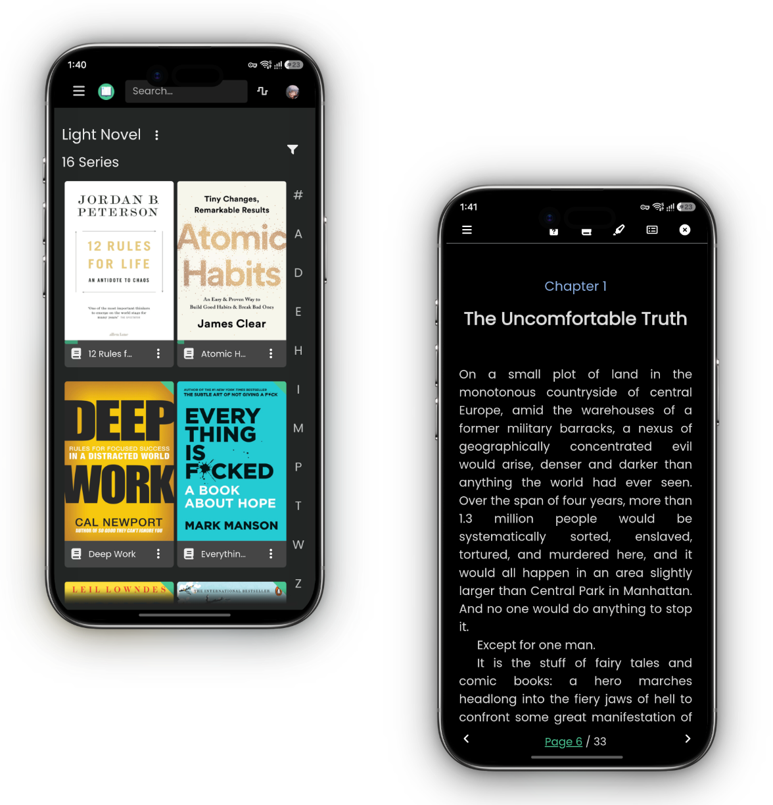

# Kavita for Android

A minimal, distraction-free Android client for [Kavita](https://github.com/Kareadita/Kavita). Instead of a native UI, the app embeds the Kavita web interface in a full-screen `WebView` — no browser chrome, no bottom navigation, no built-in reader or offline downloads. Just the Kavita server, filling the screen.

<p align="center">
  
</p>

## Features

- **Full-screen embedded web UI** — the Kavita interface rendered edge-to-edge with zoom, scrollbars and overscroll disabled.
- **True black bars** — the status and navigation bars are painted pitch black to match the app's dark-only theme.
- **Seamless appearance** — the bars blend into the page by matching the web UI's body background color.
- **Offline detection** — shows a friendly "Can't reach your server" screen when the host is unreachable, with retry.
- **Change server** — the server URL can be edited from the offline screen (persisted via DataStore).
- **Session bridge** — a small JS bridge captures the Kavita auth token from the web UI so authenticated requests work out of the box.
- **System back button** — walks the web view history first, and only exits the app when there's no history left.
- **File picker support** — file-upload dialogs from the web UI are handled natively.

## Requirements

- **JDK 17+** (Java 17 is the configured toolchain)
- **Android Studio** (latest stable, with SDK 37)
- A reachable [Kavita](https://github.com/Kareadita/Kavita) server

## Build

From the project root:

```bash
# Windows
.\gradlew.bat :app:assembleDebug

# macOS / Linux
./gradlew :app:assembleDebug
```

The debug APK is written to `app/build/outputs/apk/debug/`.

> **Windows note:** if the project and the Gradle cache live on different drives, KSP must run non-incrementally (`ksp.incremental=false` is already set in `gradle.properties`).

## Configuration

The initial server URL defaults to a LAN address in `app/src/main/java/com/u1145h/kavitaandroid/core/config/ServerConfig.kt`:

```kotlin
const val DEFAULT_SERVER_URL = "http://<your-server>:3005"
```

Once the app is running, the URL can be changed anytime from the **Change server** button on the offline screen. To make it reachable from a phone, the server should listen on your LAN or a public address (HTTP is allowed via `network_security_config.xml`).

## Project structure

```
app/src/main/java/com/u1145h/kavitaandroid/
├── core/config/          # Server defaults and tuning constants
├── data/
│   ├── local/datastore/  # DataStore preferences & session persistence
│   ├── local/database/   # Room database (kept for future native features)
│   ├── local/files/      # Book file management
│   ├── remote/           # Retrofit/OkHttp API layer, auth session
│   └── repository/       # Repository layer
├── di/                   # Hilt modules
├── feature/home/         # The embedded WebView screen, JS bridge, ViewModel
└── ui/                   # Root composable, theme, shared components
```

## Tech stack

- **Kotlin** + **Jetpack Compose** (Material 3)
- **Hilt** for dependency injection
- **DataStore** for preferences and session
- **Retrofit / OkHttp** + **kotlinx.serialization** for the API layer
- **Room** for local persistence
- **Coil** for image loading
- **WorkManager** and **Navigation** wired in for future native features

## License

This project is a third-party, unofficial client and is not affiliated with the Kavita project. Kavita is distributed under its own license. Add your own license file to this repository before publishing.
